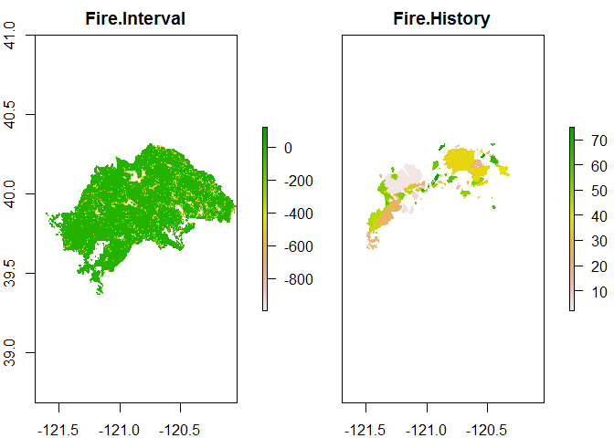
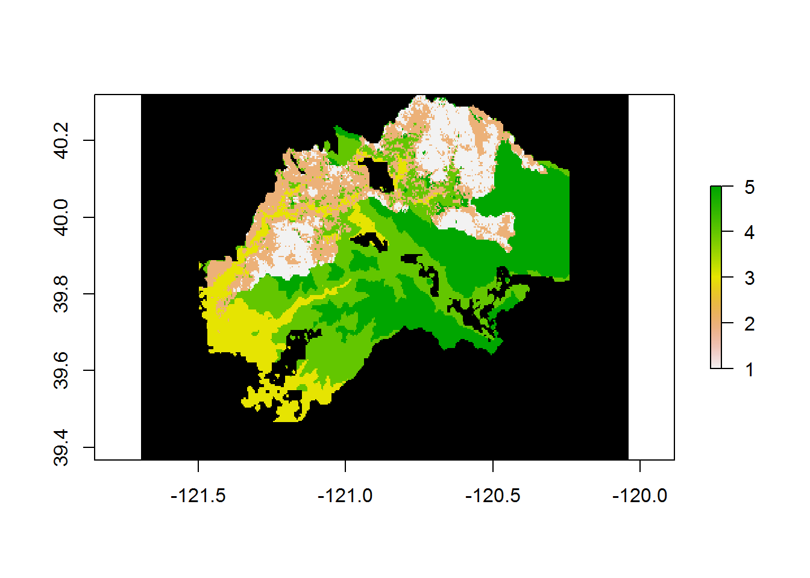

#Bat survey in Plumas National Forest through the use of acoustic bat detectors
###author: Derek Corcoran
####Last update: 2015-05-21


#Introduction

To study bat occupancy in the Plumas national forest by surveying acustically different areas of the forest, the three objective species for this survey are the Pallid bat, the Townsend's Long-eared bat, and the California Bat. Nevertheless, there is at least 14 species that form the bat ensemble in the national forest, the list of species is the following

- Tadarida brasiliensis – free-tailed bat
- *Antrozous pallidus - Pallid Bat*
- Eptesicus fuscus - Big Brown Bat
- Euderma maculatum - Spotted Bat
- Lasionycteris noctivagans - Silvered-haired Bat
- Lasiurus blossevillii - Western Red Bat
- Lasiurus cinereus - Hoary Bat
- *Corynorhinus townsendii - Townsend's Long-eared Bat*
- *Myotis californicus - California Bat*
- Myotis evotis - Long-eared Bat
- Myotis lucifugus - Little Brown Bat
- Myotis thysanodes - Fringed Bat
- Myotis volans - Hairy-winged bat
- Myotis yumanensis - Yuma myotis

##Objective of the study

To determine the factors that influence bat occupancy in heterogeneous environments of Plumas national forest, including areas corresponding to the moonlight fire and the Storrie fire. Comparing and compementing biotic and abiotic variables. 


```
## OGR data source with driver: ESRI Shapefile 
## Source: "C:/Users/usuario/Bats_California/layers", layer: "NHDFlowline"
## with 119018 features
## It has 13 fields
```

```
## Warning in readOGR(dsn = "C:/Users/usuario/Bats_California/layers", layer
## = "NHDFlowline"): Z-dimension discarded
```

# Specific resear questions and the factors that might influence them

##1. Which factors affect bat occupancy in burned forest?
        
###Does bat occupancy differ with the duration of time since the fire?

-	Explanatory variable = burn age at sampling sites (mean number of years between fires for a given point and the time till the last fire for a given point).

 

###Does bat occupancy differ with burn intensity

- Explanatory variable = burn intensity (in the following figure we see the layers that will allow us to work with burn intensity, this layers are v.1= burn intensity of the soil, v.2= burn intensity of the canopy, and v.3= Burn intensity of the basal area)

 

###Does bat occupancy differ with forest type

- Explanatory variable = Stand type 
-	Explanatory variable = Forest type (type of forest typified in SeralStage, which is seen as band 1.1 in the next figure)
-	Explanatory variable = Historic burn age (Shown as mean year intervals in the next figure as band 1.2)

 


###Does bat occupancy differ with roost site availability?

- Explanatory variable = Associated forest metrics (Lidar???, distance to water) 

**Concidering that we will work using lidar images, the layers to use will be acquired later, since most of this variables are only presented for del black polygon in the next figure.**


```
## Warning in polypath(x = mcrds[, 1], y = mcrds[, 2], border = border, col =
## col, : "legend" is not a graphical parameter
```

 

##Which factors affect bat occupancy in unburned forest?

- explanatory variables = Abiotic variables (Altitud[*shown as band 1 in the next figure*], distance to road [*shown as layer in the next figure*], distance to water *being procesed at the time*, distance to road+trail *being procesed at the time*)

 

##Is occupancy affected by presence of heterospecifics?

###is bat occupancy affected by presence of other bats? (competition)

- Explanatory variable, occupancy of other bats (based on this study)

###is bat occupancy affected by the presence of preys?

- Explanatory variable, athropod emergence (Loren's Study)

###is bat occupancy affected by the presence of predators

- Explanatory variables marten, and spotted owl layers from NFS (Spotted owl habitat foraging and nesting shown as *band 1.1* and *band 1.2* in the next figure and Marten habitat shown as *band 1.3* in the next figure)

 

#Sampling desing and sampling unit

In order for us to study bat occupancy and to spatially predict it using the factors described in the previous section, most of the diversity of the forest has to be included in the model. To include that variability, I classified the environments using the following layers (Topography, Intervals between fires, Forest Type, Distance to roads, Nesting Habitat quality for Spotted owl, foraging Habitat quality for Spotted owl, Habitat Quality for Marten) **[to be included tomorrow, distance to rivers, and distance to roads/path]**

##Check for correlation between rasters

First will scale every layer so that it goes from 0 to 1, in order for no layer to have more weight in the classification. And then we check the correlation between rasters. in the next graph/table, we see the relationship between our predictive variables. Here we see that we might want to take one of the two habitat quality layers for the Spotted Owl (R=0.74), and since we are using the spoted owl as a potential predator, we will keep the foraging habitat quality.


   

#Clasification

Now we will use kmeans to sort the area into 5 types of habitat using the abovementioned rasterstack, and it will be ploted with different colors for every type of environment.


 

More info on how to do this clasification in *https://geoscripting-wur.github.io/AdvancedRasterAnalysis/*

#separate layers acording to places with or without fire

Now we will separate the whole area in two subtypes burned areas and non-buned areas, based on the burn severity layers

  

#Extract Random points from each habitat type with equal number in fire and non fire

During the first year of sampling 120 samples will be colected, 60 in burned areas, and 60 in non-burned areas, within each, 12 random points will be sampled in each habtitat type defined by the K-means classification.


- 60 random points in not Fire, 12 random points per each environment type
- 60 random points in Fire, 12 random points per each environment type
- We plot the chosen random points over the topographic map, each color is an environment type, full circles are places where there was no fire, and full triangles, where there was a fire


 

###Values


Table: Mean value for every variable for each ID which combines prior classification (1 to 5) and fire or no fire (f or nf)

ID        Height   Fire Interval   Distance to Road   Sage Stage   Distance to Water
----  ----------  --------------  -----------------  -----------  ------------------
1nf     915.8043        3.894636           245.0825     2.097246             0.00000
1f      975.0202        4.679431           290.9402     1.751543             0.00000
2nf    1407.3704        2.368097           415.2997     1.800400             0.00000
2f     1410.7964        3.304737           377.6946     1.888302            54.12764
3nf    1611.1194        5.888377           417.7510     3.578656             0.00000
3f     1494.2475        5.476722           143.2402     3.521940            54.11404
4nf    1878.8732       13.152985           376.0677     3.657062            27.08123
4f     1788.5935       10.276782           494.8891     3.239066             0.00000
5nf    1779.6352        5.083546           740.7329     8.083679            54.20625
5f     1637.8580        6.165564           339.4208     6.256957            81.29806

#Simulated sampling Dynamic modeling


```r
library("unmarked", lib.loc="~/R/win-library/3.2")
```

###First we simulate our detection history for 30 sites with four primary sampling periods, and three secondary sampling periods each.


 s1.1   s1.2   s1.3   s2.1   s2.2   s2.3   s3.1   s3.2   s3.3   s4.1   s4.2   s4.3
-----  -----  -----  -----  -----  -----  -----  -----  -----  -----  -----  -----
    1      1      1      1      1      1      0      1      1      1      1      1
    1      1      1      1      1      1      0      0      1      1      1      1
    1      1      0      1      1      1      1      1      1      1      1      1
    1      1      1      0      1      1      1      1      1      1      1      1
    0      1      0      1      1      1      1      1      1      1      1      1
    0      1      1      1      1      1      1      1      1      1      1      1
    1      1      1      1      1      1      1      1      0      1      1      0
    1      0      1      1      1      1      1      0      1      1      1      1
    1      1      1      1      1      1      1      1      1      1      1      1
    1      1      1      1      1      1      1      0      1      1      1      1
    1      0      0      1      0      0      1      1      1      0      1      1
    1      0      0      1      0      0      1      0      0      0      0      0
    0      0      0      0      1      1      1      1      1      0      0      1
    1      0      0      1      1      1      0      1      1      0      1      0
    0      1      1      0      0      0      1      0      0      1      0      1
    0      0      0      1      1      0      1      1      0      1      0      0
    0      1      0      1      1      0      0      0      0      1      1      0
    0      1      0      1      0      1      0      0      0      1      0      1
    0      0      1      1      0      0      0      0      0      0      1      0
    1      1      0      1      0      1      1      0      0      0      0      1
    0      0      0      0      0      0      0      0      0      0      0      0
    0      0      1      0      1      0      0      0      0      0      0      0
    0      0      0      1      0      0      0      0      0      0      0      0
    0      1      1      1      0      0      0      0      0      0      0      0
    0      0      0      0      1      0      0      1      0      1      1      0
    0      0      0      1      1      0      0      0      0      0      0      0
    1      0      0      0      0      1      0      0      1      0      0      1
    1      0      0      0      1      0      0      0      0      0      0      0
    0      0      0      0      1      1      0      0      0      0      0      0
    0      0      0      0      0      0      0      0      1      0      0      0

This simulated data has some underlying characteristics:

**environment a (top 10 rows, the best environment for bats, also occupancy increases with time)**

```r
mean(sampling.ocup1[1:10])
```

```
## [1] 0.8
```
**environment b (rows 11 to 20, medium environment, occupancy stays the same)**

```r
mean(sampling.ocup1[11:20])
```

```
## [1] 0.4
```
**environment c (rows 21 to 30) poor environment for bats, also there is extintion)**

```r
mean(sampling.ocup1[21:30])
```

```
## [1] 0.2
```

Now we will simulate some variables for the site covariates.
###Site cov static
**the more variable 1, the better for bats**


```r
mean(v.1[1:10])
```

```
## [1] 20.39816
```

```r
mean(v.1[11:20])
```

```
## [1] 9.724912
```

```r
mean(v.1[21:30])
```

```
## [1] 4.93219
```


###the less variable 2 better for bats


```r
mean(v.2[1:10])
```

```
## [1] 19.85988
```

```r
mean(v.2[11:20])
```

```
## [1] 40.04326
```

```r
mean(v.2[21:30])
```

```
## [1] 60.12082
```

###variable 3 does not mater to bats


```r
mean(v.3[1:10])
```

```
## [1] 19.89459
```

```r
mean(v.3[11:20])
```

```
## [1] 19.93174
```

```r
mean(v.3[21:30])
```

```
## [1] 20.13167
```


```r
sampling.cov<- cbind(v.1,v.2, v.3)
```
###yearly colonization extintion variable


```r
temp1<-rnorm(n=30, mean=20, sd=10)
temp2<-rnorm(n=30, mean=40, sd=10)
temp3<-rnorm(n=30, mean=50, sd=10)
temp4<-rnorm(n=30, mean=60, sd=10)


temps <-cbind(temp1,temp2, temp3, temp4)
```
###observer within secondary it could be variable


###observers dont vary in the model, they should all be the same


```r
obs1<-rnorm(n=30, mean=40, sd=0.7)
obs2<-rnorm(n=30, mean=40, sd=0.7)
obs3<-rnorm(n=30, mean=40, sd=0.7)
obs4<-rnorm(n=30, mean=40, sd=0.7)
obs5<-rnorm(n=30, mean=40, sd=0.7)
obs6<-rnorm(n=30, mean=40, sd=0.7)
obs7<-rnorm(n=30, mean=40, sd=0.7)
obs8<-rnorm(n=30, mean=40, sd=0.7)
obs9<-rnorm(n=30, mean=40, sd=0.7)
obs10<-rnorm(n=30, mean=40, sd=0.7)
obs11<-rnorm(n=30, mean=40, sd=0.7)
obs12<-rnorm(n=30, mean=40, sd=0.7)

observers1<-data.frame(cbind(obs1,obs2,obs3, obs4, obs5, obs6, obs7, obs8, obs9, obs10, obs11, obs12))

observers2<-data.frame(cbind(obs1,obs2,obs3, obs4, obs5, obs6, obs7, obs8, obs9, obs10, obs11, obs12))

observers<-list(observers1, observers2)
names(observers) <-c("obs1", "obs2")
```
###primary model

```r
umf1 <- unmarkedMultFrame(y = sampling.ocup1, 
                            siteCovs = data.frame(sampling.cov), 
                            yearlySiteCovs=data.frame(temps),
                            obsCovs=observers, numPrimary=3)
```
##Dynamic model
first term static variables
second term colonization (variable)
third extintion (variable)
detection (observer)
###the best model should take into acount v.1 and v.2, but not v.3, it shouldn't take into acount observers


```r
model1 <- colext(~v.1+v.2+v.3, ~1, ~1, ~1, umf1)

model2 <- colext(~1, ~1, ~1, ~1, umf1)

model3 <- colext(~v.1+v.2, ~1, ~1, ~1, umf1) #this should be the best model
model1
```

```
## 
## Call:
## colext(psiformula = ~v.1 + v.2 + v.3, gammaformula = ~1, epsilonformula = ~1, 
##     pformula = ~1, data = umf1)
## 
## Initial:
##             Estimate    SE       z P(>|z|)
## (Intercept)   0.0822  62.0 0.00133   0.999
## v.1           1.1739  73.2 0.01604   0.987
## v.2           2.6773 108.4 0.02471   0.980
## v.3           1.6349  82.4 0.01985   0.984
## 
## Colonization:
##  Estimate   SE      z P(>|z|)
##     -0.69 1.23 -0.562   0.574
## 
## Extinction:
##  Estimate    SE     z  P(>|z|)
##     -1.71 0.419 -4.08 4.56e-05
## 
## Detection:
##  Estimate    SE    z P(>|z|)
##     0.291 0.121 2.41  0.0162
## 
## AIC: 488.0362
```

```r
model2
```

```
## 
## Call:
## colext(psiformula = ~1, gammaformula = ~1, epsilonformula = ~1, 
##     pformula = ~1, data = umf1)
## 
## Initial:
##  Estimate    SE    z P(>|z|)
##      1.78 0.569 3.13 0.00174
## 
## Colonization:
##  Estimate    SE      z P(>|z|)
##    -0.104 0.719 -0.145   0.885
## 
## Extinction:
##  Estimate    SE     z  P(>|z|)
##      -1.8 0.433 -4.15 3.36e-05
## 
## Detection:
##  Estimate    SE    z  P(>|z|)
##      0.45 0.129 3.48 0.000492
## 
## AIC: 470.846
```

```r
model3
```

```
## 
## Call:
## colext(psiformula = ~v.1 + v.2, gammaformula = ~1, epsilonformula = ~1, 
##     pformula = ~1, data = umf1)
## 
## Initial:
##             Estimate    SE       z P(>|z|)
## (Intercept)   0.0822  58.9 0.00139   0.999
## v.1           1.1733  69.6 0.01686   0.987
## v.2           2.6759 103.0 0.02598   0.979
## 
## Colonization:
##  Estimate   SE      z P(>|z|)
##     -0.69 1.23 -0.562   0.574
## 
## Extinction:
##  Estimate    SE     z  P(>|z|)
##     -1.71 0.419 -4.08 4.56e-05
## 
## Detection:
##  Estimate    SE    z P(>|z|)
##     0.291 0.121 2.41  0.0162
## 
## AIC: 486.0355
```

#APENDIX

##Apendix 1


Table: Values recorded for each selected sampling point toghether with it's ID

   Long     Lat    Height   Fire Interval   Distance to Road   Sage Stage   Distance to Water  ID  
-------  ------  --------  --------------  -----------------  -----------  ------------------  ----
 121.22   40.02    816.46            5.04               0.00         1.79                0.00  1nf 
 120.99   40.04   1009.02            2.27               0.00         1.96                0.00  1nf 
 121.09   40.01   1039.96            9.00               0.00         2.00                0.00  1nf 
 121.18   40.00   1055.73            2.98            1313.46         2.33                0.00  1nf 
 121.44   39.80    692.54            2.00               0.00         2.00                0.00  1nf 
 121.47   39.75    491.65            3.76             652.34         1.57                0.00  1nf 
 120.84   40.10   1131.19            4.85             324.47         2.93                0.00  1nf 
 121.01   40.05   1140.19            3.40               0.00         2.00                0.00  1nf 
 121.44   39.72    471.88            4.46             326.29         1.00                0.00  1nf 
 120.85   40.11   1130.94            3.27             324.43         2.00                0.00  1nf 
 121.43   39.74    833.99            2.42               0.00         2.31                0.00  1nf 
 121.02   40.05   1176.10            3.27               0.00         3.27                0.00  1nf 
 121.19   40.07   1138.89            5.63             534.18         2.00                0.00  1f  
 121.46   39.83   1133.58            5.00               0.00         1.82                0.00  1f  
 121.46   39.77    554.07            3.95               0.00         1.30                0.00  1f  
 121.27   40.01    924.52            2.92             424.21         1.33                0.00  1f  
 121.22   40.03    832.48            2.00               0.00         2.00                0.00  1f  
 121.14   40.09   1202.96            9.00               0.00         1.00                0.00  1f  
 121.24   40.03   1015.78            5.00             649.66         2.00                0.00  1f  
 121.35   39.86   1055.60            7.28             908.75         1.00                0.00  1f  
 121.11   40.10   1173.27            5.00             324.48         2.13                0.00  1f  
 120.79   40.15   1147.49            5.36             324.23         2.84                0.00  1f  
 121.29   39.96    835.38            2.83               0.00         1.59                0.00  1f  
 121.40   39.83    686.22            2.18             325.77         2.00                0.00  1f  
 120.83   40.08   1165.14            1.16               0.00         1.16                0.00  2nf 
 120.80   40.05   1333.67            3.59             424.21         1.00                0.00  2nf 
 120.80   40.06   1554.06            2.00             424.21         2.00                0.00  2nf 
 121.07   39.94   1154.73            2.34               0.00         1.37                0.00  2nf 
 120.83   40.12   1240.09            3.96             324.39         1.72                0.00  2nf 
 120.71   40.01   1637.90            2.00             534.36         2.00                0.00  2nf 
 120.84   40.16   1322.37            2.12             774.84         2.00                0.00  2nf 
 120.65   40.08   1491.07            2.00             324.58         2.00                0.00  2nf 
 120.92   40.18   1328.04            2.00            1428.19         2.00                0.00  2nf 
 120.97   40.14   1256.29            2.54               0.00         2.18                0.00  2nf 
 120.59   40.03   1704.53            2.65             424.21         2.16                0.00  2nf 
 120.80   40.08   1700.56            2.06             324.59         2.02                0.00  2nf 
 121.13   40.11   1294.74            3.54               0.00         3.00              324.43  2f  
 120.79   40.19   1301.64            2.00             324.05         1.17                0.00  2f  
 121.08   40.13   1532.44            2.00               0.00         2.00                0.00  2f  
 121.18   40.05   1268.23            2.13             974.11         2.10                0.00  2f  
 120.77   40.18   1546.57            2.07             424.21         2.07                0.00  2f  
 121.26   39.94   1504.14            5.00               0.00         1.00                0.00  2f  
 121.09   39.94   1317.19            2.04             534.53         2.01                0.00  2f  
 121.30   39.99   1282.18            5.00             975.03         2.00                0.00  2f  
 121.24   40.07   1437.02            5.00               0.00         2.03                0.00  2f  
 121.33   39.88   1435.92            5.00               0.00         1.69                0.00  2f  
 121.11   40.05   1671.22            3.43               0.00         1.43                0.00  2f  
 121.26   39.97   1338.25            2.45            1300.41         2.15              325.10  2f  
 120.87   40.21   1658.56            4.10             533.78         2.70                0.00  3nf 
 120.51   40.22   1883.36            5.35               0.00         3.25                0.00  3nf 
 121.19   39.99   1428.99            8.56            2545.26         4.70                0.00  3nf 
 120.77   40.10   1574.73            4.78             424.21         4.78                0.00  3nf 
 121.08   39.98   1513.23            6.76             325.05         2.00                0.00  3nf 
 120.72   40.12   1788.60            6.90               0.00         3.79                0.00  3nf 
 121.12   40.00   1524.62            5.24               0.00         3.00                0.00  3nf 
 120.85   40.04   1573.43            5.00               0.00         3.78                0.00  3nf 
 121.03   40.09   1581.12            5.00             534.11         5.00                0.00  3nf 
 120.70   40.12   1835.09            7.63               0.00         3.00                0.00  3nf 
 121.05   39.89   1650.44            6.35             325.50         3.94                0.00  3nf 
 121.06   39.97   1321.26            5.00             325.10         3.00                0.00  3nf 
 120.64   40.15   1678.42            4.82               0.00         4.82                0.00  3f  
 120.55   40.17   1706.50            5.00               0.00         3.36                0.00  3f  
 121.12   40.11   1285.69            5.00               0.00         3.00                0.00  3f  
 121.36   39.83   1396.31            6.13               0.00         3.17                0.00  3f  
 121.09   40.11   1248.35            5.64               0.00         2.76              324.43  3f  
 121.08   40.11   1223.04            9.00             534.06         1.60                0.00  3f  
 121.06   40.09   1789.61            5.00               0.00         4.12                0.00  3f  
 121.24   39.92   1452.79            5.00             534.61         5.55                0.00  3f  
 121.13   40.01   1581.51            5.00               0.00         3.00              324.94  3f  
 120.76   40.14   1798.88            5.00               0.00         3.00                0.00  3f  
 121.37   39.83   1404.44            5.13             325.79         4.13                0.00  3f  
 121.10   40.11   1365.42            5.00             324.43         3.76                0.00  3f  
 120.52   40.20   1894.35           14.25             324.03         3.58                0.00  4nf 
 120.48   40.19   1965.92           16.00               0.00         3.00                0.00  4nf 
 120.56   40.07   1677.93           16.00             649.22         3.58                0.00  4nf 
 120.58   39.98   1871.29           13.61               0.00         3.95                0.00  4nf 
 120.53   40.00   1852.45           15.39             324.97         2.97              324.97  4nf 
 120.45   39.93   1795.21           12.44             534.56         5.19                0.00  4nf 
 120.55   40.07   1667.79           15.57             324.63         2.44                0.00  4nf 
 120.68   40.10   2091.48            8.72            1061.84         5.25                0.00  4nf 
 120.51   40.09   1781.97           16.00               0.00         3.00                0.00  4nf 
 120.67   40.00   1978.30            8.21               0.00         3.00                0.00  4nf 
 121.16   39.89   1733.09           10.25            1293.55         4.91                0.00  4nf 
 120.63   40.01   2236.71           11.41               0.00         3.00                0.00  4nf 
 120.68   40.24   1766.99           11.00             533.67         3.34                0.00  4f  
 120.58   40.11   1820.25            9.89             424.21         4.09                0.00  4f  
 120.71   40.16   1949.12            8.69               0.00         2.23                0.00  4f  
 121.16   40.04   1590.00            9.15               0.00         2.79                0.00  4f  
 120.71   40.25   1755.68           11.00            1601.01         3.00                0.00  4f  
 120.64   40.22   1660.72           11.82               0.00         3.63                0.00  4f  
 121.11   40.13   1568.23            9.00               0.00         2.00                0.00  4f  
 120.70   40.21   1810.90           11.00             774.42         3.00                0.00  4f  
 120.80   40.27   1929.88           10.30             323.68         4.31                0.00  4f  
 121.19   40.03   1506.17           10.20             775.85         3.34                0.00  4f  
 120.74   40.19   2013.41           11.00             972.20         3.00                0.00  4f  
 120.63   40.26   2091.79           10.26             533.64         4.14                0.00  4f  
 120.43   39.96   1696.86            3.00             534.49        11.00                0.00  5nf 
 120.52   39.96   1668.65            3.00             325.14        11.00                0.00  5nf 
 121.20   39.89   1587.84            3.00             325.50         8.00                0.00  5nf 
 121.14   39.96   1809.56            8.83             325.16         5.99                0.00  5nf 
 121.19   39.90   1584.46            3.00             534.66         8.00                0.00  5nf 
 121.13   39.92   1949.94            7.25            1553.61         5.86              325.36  5nf 
 121.19   39.88   1592.18            3.00             424.21         8.00                0.00  5nf 
 121.13   39.93   2066.23            8.05            1301.20         5.37                0.00  5nf 
 121.22   39.97   1943.27            7.37             534.46         5.43              325.12  5nf 
 121.19   39.96   1991.67            8.50            1603.52         6.35                0.00  5nf 
 120.45   39.93   1796.73            3.00             776.64        11.00                0.00  5nf 
 120.47   39.97   1668.24            3.00             650.20        11.00                0.00  5nf 
 121.25   39.96   1521.28            7.00               0.00         6.00                0.00  5f  
 121.25   39.95   1647.73            7.00               0.00         6.00              325.19  5f  
 121.33   39.87   1302.56            4.98             424.21         5.94                0.00  5f  
 121.09   40.15   1396.87            9.70             324.23         7.33                0.00  5f  
 120.42   40.17   1729.92            5.58             424.21         5.63                0.00  5f  
 121.16   40.02   1046.65            6.98               0.00         5.90                0.00  5f  
 121.24   39.95   1952.34            7.00             534.53         6.00              325.21  5f  
 121.06   40.13   1800.07            5.00             324.34         5.78                0.00  5f  
 121.24   39.96   1826.39            7.75             534.50         5.63              325.17  5f  
 120.60   40.18   1537.78            3.00             533.83         8.00                0.00  5f  
 120.48   40.18   1976.98            5.00             648.17         6.88                0.00  5f  
 120.69   39.99   1915.73            5.00             325.03         6.00                0.00  5f  

