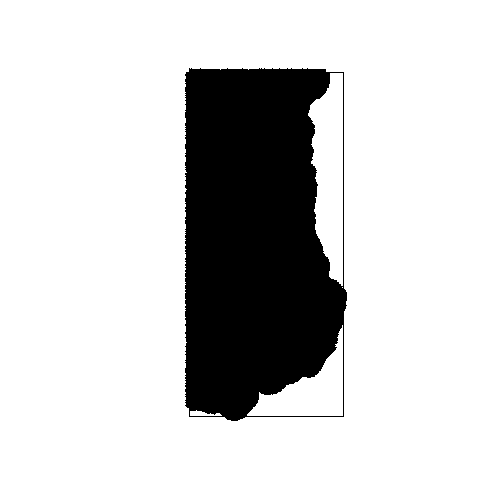

#Sampling Design
###author: Derek Corcoran
####Last update: 2015-05-05


First we load the spatial packages


```r
library("raster", lib.loc="~/R/win-library/3.2")
library("rasterVis", lib.loc="~/R/win-library/3.2")
library("maps", lib.loc="~/R/win-library/3.2")
library("maptools", lib.loc="~/R/win-library/3.2")
library("rgdal", lib.loc="~/R/win-library/3.2")
```
Then we read the needed rasters


```r
PNF<- readGDAL("C:/Users/usuario/Bats_California/layers/PNF.asc")
```

```
## C:/Users/usuario/Bats_California/layers/PNF.asc has GDAL driver AAIGrid 
## and has 250 rows and 434 columns
```

```r
PNF<-raster (PNF)
plot(PNF)
```

 

```r
bc <- readGDAL("C:/Users/usuario/Bats_California/layers/burn_canopy.asc")
```

```
## C:/Users/usuario/Bats_California/layers/burn_canopy.asc has GDAL driver AAIGrid 
## and has 250 rows and 322 columns
```

```r
bc<-raster (bc)
plot(bc)
```

 

```r
bb <- readGDAL("C:/Users/usuario/Bats_California/layers/burn_basal.asc")
```

```
## C:/Users/usuario/Bats_California/layers/burn_basal.asc has GDAL driver AAIGrid 
## and has 250 rows and 322 columns
```

```r
bb<-raster (bb)
plot(bb)
```

 

```r
bs <- readGDAL("C:/Users/usuario/Bats_California/layers/burn_severity.asc")
```

```
## C:/Users/usuario/Bats_California/layers/burn_severity.asc has GDAL driver AAIGrid 
## and has 250 rows and 322 columns
```

```r
bs<-raster (bs)
plot(bs)
```

 

```r
topo <- readGDAL("C:/Users/usuario/Bats_California/layers/plumastopo.asc")
```

```
## C:/Users/usuario/Bats_California/layers/plumastopo.asc has GDAL driver AAIGrid 
## and has 103 rows and 151 columns
```

```r
topo<-raster (topo)
plot(topo)
```

 

```r
Vegetation_existing <- readGDAL("C:/Users/usuario/Bats_California/layers/Vegetation_existing.asc")
```

```
## C:/Users/usuario/Bats_California/layers/Vegetation_existing.asc has GDAL driver AAIGrid 
## and has 250 rows and 314 columns
```

```r
Vegetation_existing<-raster (Vegetation_existing)
plot(Vegetation_existing)
```

 

```r
FireReturnIntervalDeparture <- readGDAL("C:/Users/usuario/Bats_California/layers/FireReturnIntervalDeparture.asc")
```

```
## C:/Users/usuario/Bats_California/layers/FireReturnIntervalDeparture.asc has GDAL driver AAIGrid 
## and has 250 rows and 329 columns
```

```r
FireReturnIntervalDeparture<-raster (FireReturnIntervalDeparture)
plot(FireReturnIntervalDeparture)
```

 

```r
TreatmentsStorrie <- readGDAL("C:/Users/usuario/Bats_California/layers/TreatmentsStorrie.asc")
```

```
## C:/Users/usuario/Bats_California/layers/TreatmentsStorrie.asc has GDAL driver AAIGrid 
## and has 271 rows and 250 columns
```

```r
TreatmentsStorrie<-raster (TreatmentsStorrie)
plot(TreatmentsStorrie)
```

 

#Change outlayers and extract NAs 

In order to classify the raster we will get rid of unnecesary outlayers, and change NAs to 0


```r
df.bb <- data.frame(id=c(NA,1,2,3,4,5,6,7,255), v=c(0,1,2,3,4,5,6,7,8))
bb1 <- subs(bb, df.bb,subswithNA=FALSE)
df.bs <- data.frame(id=c(NA,1,2,3,4,255), v=c(0,1,2,3,4,5))
bs1 <- subs(bs, df.bs,subswithNA=FALSE)
df.bc <- data.frame(id=c(NA,1,2,3,4,5,255), v=c(0,1,2,3,4,5,6))
bc1 <- subs(bc, df.bc,subswithNA=FALSE)
```

#Put all rasters in the same projection


```r
bb<-projectRaster(bb1, PNF)
bs<-projectRaster(bs1, PNF)
bc<-projectRaster(bc1, PNF)
Vegetation_existing<-projectRaster(Vegetation_existing, PNF)
FireReturnIntervalDeparture<-projectRaster(FireReturnIntervalDeparture, PNF)
TreatmentsStorrie<-projectRaster(TreatmentsStorrie, PNF)
```
#Put them all in the same resolution and size


```r
bc<-resample(bc, PNF)
bb<-resample(bb, PNF)
bs<-resample(bs, PNF)
Vegetation_existing<-resample(Vegetation_existing, PNF)
FireReturnIntervalDeparture<-resample(FireReturnIntervalDeparture, PNF)
FireReturnIntervalDeparture[is.na(FireReturnIntervalDeparture)] <- 0
TreatmentsStorrie<-resample(TreatmentsStorrie, PNF)
topo<-resample(topo,PNF)
TreatmentsStorrie[is.na(TreatmentsStorrie)] <- 0
```

#Prepare a distance from river/road raster


```r
roads.v <- readOGR(dsn="C:/Users/usuario/Bats_California/layers",layer="Roads")
```

```
## OGR data source with driver: ESRI Shapefile 
## Source: "C:/Users/usuario/Bats_California/layers", layer: "Roads"
## with 4127 features
## It has 22 fields
```

```
## Warning in readOGR(dsn = "C:/Users/usuario/Bats_California/layers", layer
## = "Roads"): Z-dimension discarded
```

```r
roads.v <- spTransform(roads.v, CRS("+proj=longlat +ellps=GRS80 +towgs84=0,0,0,0,0,0,0 +no_defs"))
plot(PNF)
lines(roads.v)
template <- PNF  # this will be the template
template[] <- NA  # assigns all values as NA
roads.r <- rasterize(roads.v, template, field=1)
summary(roads.r)          # pixels crossed by a road have "1" 
```

```
##         layer
## Min.        1
## 1st Qu.     1
## Median      1
## 3rd Qu.     1
## Max.        1
## NA's    86439
```

```r
plot(roads.r, add=TRUE)
```

 
after rasterizing the roads we make the new raster

```r
roaddist.r <- distance(roads.r)
class(roaddist.r)
```

```
## [1] "RasterLayer"
## attr(,"package")
## [1] "raster"
```

```r
# Check:
plot(roaddist.r)
lines(roads.v)
```

 
#Check for correlation between rasters


```r
AllLayers1 <-stack(topo,TreatmentsStorrie,FireReturnIntervalDeparture, Vegetation_existing)
plot (AllLayers1, colNA="black")
```

 

```r
pairs(AllLayers1)
```

 

```r
rasterRescale<-function(r){
    ((r-cellStats(r,"min"))/(cellStats(r,"max")-cellStats(r,"min")))
}
AllLayers2<-rasterRescale(AllLayers1)
plot(AllLayers2)
```

 

#Clasification example

Even though we shouldn't classify using 3 layers of such high classification we will use the RasterBrick of the three burn classifications to exemplify how we will divide the area into areas of similar characteristics.
Here we will ask R to use kmeans to sort the area into 3 types of habitat using the abovementioned rasterbrick:


#now with every layer


```
##      band1.1 band1.2 band1.3 band1.4
## [1,]      NA       0       0      NA
## [2,]      NA       0       0      NA
## [3,]      NA       0       0      NA
## [4,]      NA       0       0      NA
## [5,]      NA       0       0      NA
## [6,]      NA       0       0      NA
```

```
##     band1.1         band1.2             band1.3           band1.4     
##  Min.   :0.00    Min.   :0.0000000   Min.   :0.00000   Min.   :0      
##  1st Qu.:0.50    1st Qu.:0.0000000   1st Qu.:0.00000   1st Qu.:0      
##  Median :0.61    Median :0.0000000   Median :0.00000   Median :0      
##  Mean   :0.60    Mean   :0.0009901   Mean   :0.06097   Mean   :0      
##  3rd Qu.:0.72    3rd Qu.:0.0000000   3rd Qu.:0.00000   3rd Qu.:0      
##  Max.   :1.00    Max.   :1.0000000   Max.   :1.00000   Max.   :1      
##  NA's   :34580                                         NA's   :64063
```

 

```
##         layer
## Min.        1
## 1st Qu.     2
## Median      4
## 3rd Qu.     5
## Max.        5
## NA's    66965
```

More info on how to do this clasification in *https://geoscripting-wur.github.io/AdvancedRasterAnalysis/*

#separate layers acording to places with or without fire


```r
df.bs1 <- data.frame(id=c(0,1,2,3,4,5), v=c(NA,1,1,1,1,1))
fire <- subs(bs1, df.bs1,subswithNA=FALSE)
fire<-projectRaster(fire, PNF)

df.bs2 <- data.frame(id=c(NA,1), v=c(1,NA))
not.fire <- subs(fire, df.bs2,subswithNA=FALSE)

plot(fire, colNA="black")
```

 

```r
plot(not.fire, colNA="black")
```

 

```r
summary(fire)
```

```
##             v
## Min.        1
## 1st Qu.     1
## Median      1
## 3rd Qu.     1
## Max.        1
## NA's    97885
```

```r
summary(not.fire)
```

```
##             v
## Min.        1
## 1st Qu.     1
## Median      1
## 3rd Qu.     1
## Max.        1
## NA's    10615
```

```r
classes.with.fire<-classes2.1*fire
classes.without.fire<-classes2.1*not.fire

plot(classes.with.fire,colNA="black")
```

 

```r
summary(classes.with.fire)
```

```
##         layer
## Min.        1
## 1st Qu.     2
## Median      2
## 3rd Qu.     4
## Max.        5
## NA's    98364
```

```r
plot(classes.without.fire,colNA="black")
```

 

```r
summary(classes.without.fire)
```

```
##         layer
## Min.        1
## 1st Qu.     3
## Median      4
## 3rd Qu.     5
## Max.        5
## NA's    77101
```

#Extract Random points from each habitat type with equal number in fire and non fire


```r
set.seed(9)

df.class.1f <- data.frame(id=c(1,2,3,4,5), v=c(1,NA,NA,NA,NA))
class1f <- subs(classes.with.fire, df.class.1f,subswithNA=FALSE)
points1f<-sampleRandom(class1f,3, na.rm=TRUE, xy=TRUE)

df.class.1nf <- data.frame(id=c(1,2,3,4,5), v=c(1,NA,NA,NA,NA))
class1nf <- subs(classes.without.fire, df.class.1nf,subswithNA=FALSE)
points1nf<-sampleRandom(class1nf,3, na.rm=TRUE, xy=TRUE)

df.class.2f <- data.frame(id=c(1,2,3,4,5), v=c(NA,2,NA,NA,NA))
class2f <- subs(classes.with.fire, df.class.2f,subswithNA=FALSE)
points2f<-sampleRandom(class2f,3, na.rm=TRUE, xy=TRUE)

df.class.2nf <- data.frame(id=c(1,2,3,4,5), v=c(NA,2,NA,NA,NA))
class2nf <- subs(classes.without.fire, df.class.2nf,subswithNA=FALSE)
points2nf<-sampleRandom(class2nf,3, na.rm=TRUE, xy=TRUE)

df.class.3f <- data.frame(id=c(1,2,3,4,5), v=c(NA,NA,3,NA,NA))
class3f <- subs(classes.with.fire, df.class.3f,subswithNA=FALSE)
points3f<-sampleRandom(class3f,3, na.rm=TRUE, xy=TRUE)

df.class.3nf <- data.frame(id=c(1,2,3,4,5), v=c(NA,NA,3,NA,NA))
class3nf <- subs(classes.without.fire, df.class.3nf,subswithNA=FALSE)
points3nf<-sampleRandom(class3nf,3, na.rm=TRUE, xy=TRUE)

df.class.4f <- data.frame(id=c(1,2,3,4,5), v=c(NA,NA,NA,4,NA))
class4f <- subs(classes.with.fire, df.class.4f,subswithNA=FALSE)
points4f<-sampleRandom(class4f,3, na.rm=TRUE, xy=TRUE)

df.class.4nf <- data.frame(id=c(1,2,3,4,5), v=c(NA,NA,NA,4,NA))
class4nf <- subs(classes.without.fire, df.class.4nf,subswithNA=FALSE)
points4nf<-sampleRandom(class4nf,3, na.rm=TRUE, xy=TRUE)

df.class.5f <- data.frame(id=c(1,2,3,4,5), v=c(NA,NA,NA,NA,5))
class5f <- subs(classes.with.fire, df.class.5f,subswithNA=FALSE)
points5f<-sampleRandom(class5f,3, na.rm=TRUE, xy=TRUE)

df.class.5nf <- data.frame(id=c(1,2,3,4,5), v=c(NA,NA,NA,NA,5))
class5nf <- subs(classes.without.fire, df.class.5nf,subswithNA=FALSE)
points5nf<-sampleRandom(class5nf,3, na.rm=TRUE, xy=TRUE)

plot(classes2.1, colNA="white")
points (points1f, col= "black", pch=21, bg="black")
points (points1nf, col="black",pch=24,bg="black")
points (points2f, col= "blue",pch=21,bg="blue")
points (points2nf, col="blue", pch=24, bg="blue")
points (points3f, col= "red",pch=21, bg="red")
points (points3nf, col="red", pch=24,bg="red")
points (points4f, col= "brown",pch=21,bg="brown")
points (points4nf, col="brown", pch=24,bg="brown")
points (points5f, col= "purple",pch=21,bg="purple")
points (points5nf, col="purple", pch=24, bg="purple")
```

 


#Simulated sampling Dynamic modeling


```r
library("unmarked", lib.loc="~/R/win-library/3.2")
```

```
## Loading required package: reshape
## Loading required package: Rcpp
## 
## Attaching package: 'unmarked'
## 
## The following objects are masked from 'package:raster':
## 
##     getData, projection
## 
## The following object is masked from 'package:sp':
## 
##     coordinates
```

###First we simulate our detection history for 30 sites with four primary sampling periods, and three secondary sampling periods each.


| s1.1| s1.2| s1.3| s2.1| s2.2| s2.3| s3.1| s3.2| s3.3| s4.1| s4.2| s4.3|
|----:|----:|----:|----:|----:|----:|----:|----:|----:|----:|----:|----:|
|    1|    1|    1|    1|    1|    1|    0|    1|    1|    1|    1|    1|
|    1|    1|    1|    1|    1|    1|    0|    0|    1|    1|    1|    1|
|    1|    1|    0|    1|    1|    1|    1|    1|    1|    1|    1|    1|
|    1|    1|    1|    0|    1|    1|    1|    1|    1|    1|    1|    1|
|    0|    1|    0|    1|    1|    1|    1|    1|    1|    1|    1|    1|
|    0|    1|    1|    1|    1|    1|    1|    1|    1|    1|    1|    1|
|    1|    1|    1|    1|    1|    1|    1|    1|    0|    1|    1|    0|
|    1|    0|    1|    1|    1|    1|    1|    0|    1|    1|    1|    1|
|    1|    1|    1|    1|    1|    1|    1|    1|    1|    1|    1|    1|
|    1|    1|    1|    1|    1|    1|    1|    0|    1|    1|    1|    1|
|    1|    0|    0|    1|    0|    0|    1|    1|    1|    0|    1|    1|
|    1|    0|    0|    1|    0|    0|    1|    0|    0|    0|    0|    0|
|    0|    0|    0|    0|    1|    1|    1|    1|    1|    0|    0|    1|
|    1|    0|    0|    1|    1|    1|    0|    1|    1|    0|    1|    0|
|    0|    1|    1|    0|    0|    0|    1|    0|    0|    1|    0|    1|
|    0|    0|    0|    1|    1|    0|    1|    1|    0|    1|    0|    0|
|    0|    1|    0|    1|    1|    0|    0|    0|    0|    1|    1|    0|
|    0|    1|    0|    1|    0|    1|    0|    0|    0|    1|    0|    1|
|    0|    0|    1|    1|    0|    0|    0|    0|    0|    0|    1|    0|
|    1|    1|    0|    1|    0|    1|    1|    0|    0|    0|    0|    1|
|    0|    0|    0|    0|    0|    0|    0|    0|    0|    0|    0|    0|
|    0|    0|    1|    0|    1|    0|    0|    0|    0|    0|    0|    0|
|    0|    0|    0|    1|    0|    0|    0|    0|    0|    0|    0|    0|
|    0|    1|    1|    1|    0|    0|    0|    0|    0|    0|    0|    0|
|    0|    0|    0|    0|    1|    0|    0|    1|    0|    1|    1|    0|
|    0|    0|    0|    1|    1|    0|    0|    0|    0|    0|    0|    0|
|    1|    0|    0|    0|    0|    1|    0|    0|    1|    0|    0|    1|
|    1|    0|    0|    0|    1|    0|    0|    0|    0|    0|    0|    0|
|    0|    0|    0|    0|    1|    1|    0|    0|    0|    0|    0|    0|
|    0|    0|    0|    0|    0|    0|    0|    0|    1|    0|    0|    0|

This simulated data has some underlying characteristics:

**environment a (top 10 rows, the best environment for bats, also occupancy increases with time)**

```r
mean(sampling.ocup1[1:10])
```

```
## [1] 0.8
```
**environment b (rows 11 to 20, medium environment, occupancy stays the same)**

```r
mean(sampling.ocup1[11:20])
```

```
## [1] 0.4
```
**environment c (rows 21 to 30) poor environment for bats, also there is extintion)**

```r
mean(sampling.ocup1[21:30])
```

```
## [1] 0.2
```

Now we will simulate some variables for the site covariates.
###Site cov static
**the more variable 1, the better for bats**


```r
mean(v.1[1:10])
```

```
## [1] 20.39816
```

```r
mean(v.1[11:20])
```

```
## [1] 9.724912
```

```r
mean(v.1[21:30])
```

```
## [1] 4.93219
```


###the less variable 2 better for bats


```r
mean(v.2[1:10])
```

```
## [1] 19.85988
```

```r
mean(v.2[11:20])
```

```
## [1] 40.04326
```

```r
mean(v.2[21:30])
```

```
## [1] 60.12082
```

###variable 3 does not mater to bats


```r
mean(v.3[1:10])
```

```
## [1] 19.89459
```

```r
mean(v.3[11:20])
```

```
## [1] 19.93174
```

```r
mean(v.3[21:30])
```

```
## [1] 20.13167
```


```r
sampling.cov<- cbind(v.1,v.2, v.3)
```
###yearly colonization extintion variable


```r
temp1<-rnorm(n=30, mean=20, sd=10)
temp2<-rnorm(n=30, mean=40, sd=10)
temp3<-rnorm(n=30, mean=50, sd=10)
temp4<-rnorm(n=30, mean=60, sd=10)


temps <-cbind(temp1,temp2, temp3, temp4)
```
###observer within secondary it could be variable


###observers dont vary in the model, they should all be the same


```r
obs1<-rnorm(n=30, mean=40, sd=0.7)
obs2<-rnorm(n=30, mean=40, sd=0.7)
obs3<-rnorm(n=30, mean=40, sd=0.7)
obs4<-rnorm(n=30, mean=40, sd=0.7)
obs5<-rnorm(n=30, mean=40, sd=0.7)
obs6<-rnorm(n=30, mean=40, sd=0.7)
obs7<-rnorm(n=30, mean=40, sd=0.7)
obs8<-rnorm(n=30, mean=40, sd=0.7)
obs9<-rnorm(n=30, mean=40, sd=0.7)
obs10<-rnorm(n=30, mean=40, sd=0.7)
obs11<-rnorm(n=30, mean=40, sd=0.7)
obs12<-rnorm(n=30, mean=40, sd=0.7)

observers1<-data.frame(cbind(obs1,obs2,obs3, obs4, obs5, obs6, obs7, obs8, obs9, obs10, obs11, obs12))

observers2<-data.frame(cbind(obs1,obs2,obs3, obs4, obs5, obs6, obs7, obs8, obs9, obs10, obs11, obs12))

observers<-list(observers1, observers2)
names(observers) <-c("obs1", "obs2")
```
###primary model

```r
umf1 <- unmarkedMultFrame(y = sampling.ocup1, 
                            siteCovs = data.frame(sampling.cov), 
                            yearlySiteCovs=data.frame(temps),
                            obsCovs=observers, numPrimary=3)
```
##Dynamic model
first term static variables
second term colonization (variable)
third extintion (variable)
detection (observer)
###the best model should take into acount v.1 and v.2, but not v.3, it shouldn't take into acount observers


```r
model1 <- colext(~v.1+v.2+v.3, ~1, ~1, ~1, umf1)

model2 <- colext(~1, ~1, ~1, ~1, umf1)

model3 <- colext(~v.1+v.2, ~1, ~1, ~1, umf1) #this should be the best model
model1
```

```
## 
## Call:
## colext(psiformula = ~v.1 + v.2 + v.3, gammaformula = ~1, epsilonformula = ~1, 
##     pformula = ~1, data = umf1)
## 
## Initial:
##             Estimate    SE       z P(>|z|)
## (Intercept)   0.0822  62.0 0.00133   0.999
## v.1           1.1739  73.2 0.01604   0.987
## v.2           2.6773 108.4 0.02471   0.980
## v.3           1.6349  82.4 0.01985   0.984
## 
## Colonization:
##  Estimate   SE      z P(>|z|)
##     -0.69 1.23 -0.562   0.574
## 
## Extinction:
##  Estimate    SE     z  P(>|z|)
##     -1.71 0.419 -4.08 4.56e-05
## 
## Detection:
##  Estimate    SE    z P(>|z|)
##     0.291 0.121 2.41  0.0162
## 
## AIC: 488.0362
```

```r
model2
```

```
## 
## Call:
## colext(psiformula = ~1, gammaformula = ~1, epsilonformula = ~1, 
##     pformula = ~1, data = umf1)
## 
## Initial:
##  Estimate    SE    z P(>|z|)
##      1.78 0.569 3.13 0.00174
## 
## Colonization:
##  Estimate    SE      z P(>|z|)
##    -0.104 0.719 -0.145   0.885
## 
## Extinction:
##  Estimate    SE     z  P(>|z|)
##      -1.8 0.433 -4.15 3.36e-05
## 
## Detection:
##  Estimate    SE    z  P(>|z|)
##      0.45 0.129 3.48 0.000492
## 
## AIC: 470.846
```

```r
model3
```

```
## 
## Call:
## colext(psiformula = ~v.1 + v.2, gammaformula = ~1, epsilonformula = ~1, 
##     pformula = ~1, data = umf1)
## 
## Initial:
##             Estimate    SE       z P(>|z|)
## (Intercept)   0.0822  58.9 0.00139   0.999
## v.1           1.1733  69.6 0.01686   0.987
## v.2           2.6759 103.0 0.02598   0.979
## 
## Colonization:
##  Estimate   SE      z P(>|z|)
##     -0.69 1.23 -0.562   0.574
## 
## Extinction:
##  Estimate    SE     z  P(>|z|)
##     -1.71 0.419 -4.08 4.56e-05
## 
## Detection:
##  Estimate    SE    z P(>|z|)
##     0.291 0.121 2.41  0.0162
## 
## AIC: 486.0355
```
###graph
