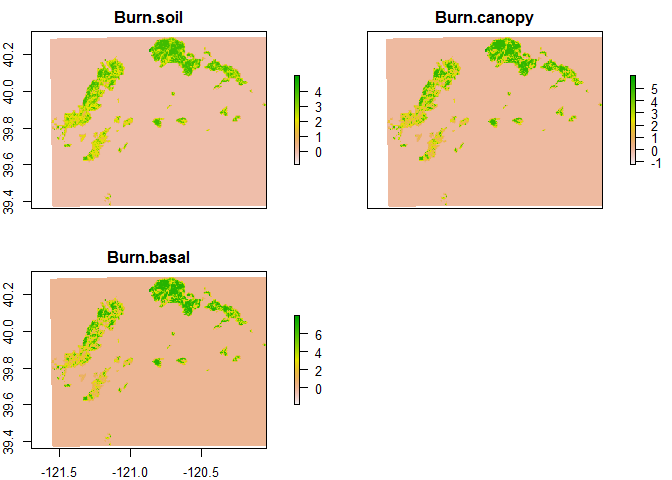

#Bat survey in Plumas National Forest through the use of acoustic bat detectors
###author: Derek Corcoran
####Last update: 2015-06-01


#Introduction

To study bat occupancy in the Plumas National Forest by surveying acustically different areas of the forest, the three objective species for this survey are the Pallid Bat, the Townsend's Long-eared Bat, and the California Bat. Nevertheless, there is at least 14 species that form the bat ensemble in the National Forest, the list of species is the following

- *Tadarida brasiliensis* – free-tailed Bat
- *Antrozous pallidus* - **Pallid Bat**
- *Eptesicus fuscus* - Big Brown Bat
- *Euderma maculatum* - Spotted Bat
- *Lasionycteris noctivagans* - Silvered-haired Bat
- *Lasiurus blossevillii* - Western Red Bat
- *Lasiurus cinereus* - Hoary Bat
- *Corynorhinus townsendii* - **Townsend's Long-eared Bat**
- *Myotis californicus* - **California Bat**
- *Myotis evotis* - Long-eared Bat
- *Myotis lucifugus* - Little Brown Bat
- *Myotis thysanodes* - Fringed Bat
- *Myotis volans* - Hairy-winged bat
- *Myotis yumanensis* - Yuma myotis

##Objective of the study

To determine the factors that influence bat occupancy in heterogeneous environments of Plumas National Forest, including areas corresponding to the Moonlight Fire and the Storrie Fire. Comparing and complementing biotic and abiotic variables. 


```
## OGR data source with driver: ESRI Shapefile 
## Source: "C:/Users/usuario/Bats_California/layers", layer: "NHDFlowline"
## with 119018 features
## It has 13 fields
```

```
## Warning in readOGR(dsn = "C:/Users/usuario/Bats_California/layers", layer
## = "NHDFlowline"): Z-dimension discarded
```

# Specific research questions and the factors that might influence them

##1. Which factors affect bat occupancy in burned forest?
        
###Does bat occupancy differ with the duration of time since the fire?

-	Explanatory variable = burn age at sampling sites (mean number of years between fires for a given point and the time till the last fire for a given point).

 

###Does bat occupancy differ with burn intensity

- Explanatory variable = burn intensity (in the following figure we see the layers that will allow us to work with burn intensity, this layers are burn intensity of the soil, burn intensity of the canopy, and Burn intensity of the basal area)

 

###Does bat occupancy differ with forest type

- Explanatory variable = Stand type 
-	Explanatory variable = Forest type (type of forest typified in SeralStageariabariables = Abiotic variables (Altitud, di
-	Explanatory variable = Historic burn age 

 


###Does bat occupancy differ with roost site availability?

- Explanatory variable = Associated forest metrics (Lidar???, distance to water) 

**Concidering that we will work using lidar images, the layers to use will be acquired later, since most of this variables are only presented for del black polygon in the next figure.**


```
## Warning in polypath(x = mcrds[, 1], y = mcrds[, 2], border = border, col =
## col, : "legend" is not a graphical parameter
```

 

##Which factors affect bat occupancy in unburned forest?

- explanatory vstance to road, distance to water)

 

##Is occupancy affected by presence of heterospecifics?

###is bat occupancy affected by presence of other bats? (competition)

- Explanatory variable, occupancy of other bats (based on this study)

###is bat occupancy affected by the presence of preys?

- Explanatory variable, athropod emergence (Loren's Study)

#Sampling desing and sampling unit

In order for us to study bat occupancy and to spatially predict it using the factors described in the previous section, most of the diversity of the forest has to be included in the model. To include that variability, I classified the environments using the following layers (Topography, Intervals between fires, Forest Type, Distance to roads, Nesting Habitat quality for Spotted owl, foraging Habitat quality for Spotted owl, Habitat Quality for Marten) **[to be included tomorrow, distance to rivers, and distance to roads/path]**

##Check for correlation between rasters

First will scale every layer so that it goes from 0 to 1, in order for no layer to have more weight in the classification. And then we check the correlation between rasters. in the next graph/table, we see the relationship between our predictive variables. Here we see that we might want to take one of the two habitat quality layers for the Spotted Owl (R=0.74), and since we are using the spoted owl as a potential predator, we will keep the foraging habitat quality.


```
## Loading required package: sp
```

               slope
Min.        0.000000
1st Qu.     2.873498
Median      5.359555
3rd Qu.     8.648955
Max.       28.828351
NA's    35684.000000
    

#Clasification

Now we will use kmeans to sort the area into 5 types of habitat using the abovementioned rasterstack, and it will be ploted with different colors for every type of environment.


 

More info on how to do this clasification in *https://geoscripting-wur.github.io/AdvancedRasterAnalysis/*

#separate layers acording to places with or without fire

Now we will separate the whole area in two subtypes burned areas and non-buned areas, based on the burn severity layers

  

#Extract Random points from each habitat type with equal number in fire and non fire

During the first year of sampling 120 samples will be colected, 60 in burned areas, and 60 in non-burned areas, within each, 12 random points will be sampled in each habtitat type defined by the K-means classification.


- 60 random points in not Fire, 12 random points per each environment type
- 60 random points in Fire, 12 random points per each environment type
- We plot the chosen random points over the topographic map, each color is an environment type, full circles are places where there was no fire, and full triangles, where there was a fire


```
## rgdal: version: 0.9-2, (SVN revision 526)
## Geospatial Data Abstraction Library extensions to R successfully loaded
## Loaded GDAL runtime: GDAL 1.11.2, released 2015/02/10
## Path to GDAL shared files: C:/Users/usuario/Documents/R/win-library/3.2/rgdal/gdal
## GDAL does not use iconv for recoding strings.
## Loaded PROJ.4 runtime: Rel. 4.9.1, 04 March 2015, [PJ_VERSION: 491]
## Path to PROJ.4 shared files: C:/Users/usuario/Documents/R/win-library/3.2/rgdal/proj
```


```
## Loading required package: lattice
## Loading required package: latticeExtra
## Loading required package: RColorBrewer
```

 


###Values


```
## 
## Attaching package: 'dplyr'
## 
## The following objects are masked from 'package:raster':
## 
##     intersect, select, union
## 
## The following object is masked from 'package:stats':
## 
##     filter
## 
## The following objects are masked from 'package:base':
## 
##     intersect, setdiff, setequal, union
```


Table: Mean value for every variable for each ID which combines prior classification (1 to 5) and fire or no fire (f or nf)

ID       Height   Fire Interval   Distance to Road   Sage Stage   Distance to Water
----  ---------  --------------  -----------------  -----------  ------------------
1nf    1143.428        18.92636           70.70175    14.687060             0.00000
1f     1066.892        16.14099          381.48419    14.475234             0.00000
2nf    1798.345        14.70257          135.51784     4.956801             0.00000
2f     1733.110        16.35523          234.08921     5.477256             0.00000
3nf    1741.085        15.92650          277.42844     6.558292           342.73342
3f     1665.289        15.78163          305.06839     4.767730           341.64344
4nf    1777.849        24.37396          304.86406    16.390226            62.43815
4f     1673.955        13.77037          567.23379    14.868093            27.02978
5nf    1092.211        14.48702          189.65352     5.285532             0.00000
5f     1169.350        13.36700          315.70665     5.507521             0.00000

#Simulated sampling Dynamic modeling


```r
library("unmarked", lib.loc="~/R/win-library/3.2")
```

###First we simulate our detection history for our 120 sites with four primary sampling periods, and three secondary sampling periods each.
 


```
##        nPars    AIC delta   AICwt cumltvWt
## Model1     2 481.49  0.00 0.99931     1.00
## Model3     7 496.92 15.43 0.00045     1.00
## Model2     8 498.12 16.62 0.00025     1.00
```

  


 

```
##    Predicted    
##  Min.   :0.08   
##  1st Qu.:0.52   
##  Median :0.58   
##  Mean   :0.58   
##  3rd Qu.:0.64   
##  Max.   :0.87   
##  NA's   :74441
```

```
## [1] 19720.2
```

```
## [1] 14501.36
```

```
## [1] 24518.73
```

#APENDIX

##Apendix 1


Table: Values recorded for each selected sampling point toghether with it's ID

   Long     Lat    Height   Fire Interval   Distance to Road   Vegetation Type   Distance to Water  ID  
-------  ------  --------  --------------  -----------------  ----------------  ------------------  ----
 120.91   39.98   1145.27           15.81             424.21             12.41                0.00  1nf 
 121.09   40.02    983.53           11.68               0.00             10.22                0.00  1nf 
 120.87   39.96   1237.23           25.68               0.00             12.37                0.00  1nf 
 121.00   39.94   1279.09           21.48               0.00             11.73                0.00  1nf 
 120.80   39.87   1424.25           15.16             424.21             15.47                0.00  1nf 
 121.38   39.75    797.21           21.40               0.00             18.00                0.00  1nf 
 120.82   40.08   1241.51           19.82               0.00             14.47                0.00  1nf 
 120.98   40.04   1010.16           26.50               0.00             18.00                0.00  1nf 
 121.40   39.67    757.34           17.29               0.00             10.82                0.00  1nf 
 120.64   40.10   1411.36           16.00               0.00             18.00                0.00  1nf 
 120.55   39.73   1428.79           12.89               0.00             16.76                0.00  1nf 
 120.99   40.04   1005.39           23.42               0.00             18.00                0.00  1nf 
 120.80   40.18   1280.15           16.42               0.00             17.61                0.00  1f  
 121.25   39.72    731.23           16.00               0.00             12.28                0.00  1f  
 121.25   39.66    946.98           14.42             848.42             13.27                0.00  1f  
 121.21   40.07   1098.96           19.60            1428.69             14.79                0.00  1f  
 121.22   40.11   1302.51           16.00             324.43             18.00                0.00  1f  
 120.84   40.19   1410.15           17.48             908.19             10.71                0.00  1f  
 121.22   40.11   1243.52           15.68               0.00             17.04                0.00  1f  
 121.42   39.83    584.98           16.00               0.00             10.43                0.00  1f  
 120.79   40.20   1393.51           16.00             533.80             18.00                0.00  1f  
 120.76   40.21   1335.86           14.71               0.00             14.14                0.00  1f  
 121.11   40.04   1039.99           20.12             534.28             18.00                0.00  1f  
 121.47   39.73    434.85           11.25               0.00              9.42                0.00  1f  
 120.71   39.93   2069.65            7.16               0.00              6.93                0.00  2nf 
 120.60   39.85   2004.34           16.00               0.00              4.29                0.00  2nf 
 121.13   39.87   1790.30           16.00             325.57              7.00                0.00  2nf 
 121.02   39.67   1580.89           16.00               0.00              6.93                0.00  2nf 
 120.39   40.05   1911.05           16.00             324.74              3.00                0.00  2nf 
 121.04   39.75   1771.12           16.00               0.00              6.54                0.00  2nf 
 121.03   40.14   1678.18           15.74               0.00              3.00                0.00  2nf 
 120.62   39.94   1859.34           14.79             325.26              3.00                0.00  2nf 
 120.60   40.23   1734.92           16.00               0.00              3.00                0.00  2nf 
 121.01   40.08   1725.45           15.74               0.00              5.79                0.00  2nf 
 120.68   39.77   1548.83           11.00               0.00              3.00                0.00  2nf 
 121.20   39.93   1906.07           16.00             650.64              7.00                0.00  2nf 
 121.14   40.15   1530.05           12.56             324.27              7.68                0.00  2f  
 120.72   40.23   1635.56           12.30               0.00              3.00                0.00  2f  
 120.64   40.16   1739.43           16.00             533.90              3.53                0.00  2f  
 120.26   40.10   1908.27           14.97             424.21              5.67                0.00  2f  
 120.84   40.21   1643.31           11.93               0.00              5.80                0.00  2f  
 120.79   39.85   1594.26           14.38               0.00              2.77                0.00  2f  
 120.26   39.85   1773.72           23.05               0.00              9.02                0.00  2f  
 121.22   39.92   1863.16           16.00             776.73              7.00                0.00  2f  
 120.29   40.12   1903.38           26.00             424.21              2.00                0.00  2f  
 121.11   39.83   1725.65           24.36             325.75              5.66                0.00  2f  
 120.61   40.09   1870.59           12.13               0.00              6.38                0.00  2f  
 121.29   39.86   1609.96           12.58               0.00              7.21                0.00  2f  
 120.63   40.07   1605.53           18.51             324.63             12.26              324.63  3nf 
 121.00   40.09   1706.44           11.00            1068.23              3.00              324.52  3nf 
 120.42   39.87   1798.85           12.92             325.59              9.18              325.59  3nf 
 120.61   40.00   2196.98           25.10               0.00              9.45              324.97  3nf 
 121.01   39.86   1747.54           16.00               0.00              7.00              325.64  3nf 
 121.13   40.00   1625.41           16.00             424.21              6.68              324.96  3nf 
 121.25   39.88   1504.05           14.05             325.52              3.00              325.52  3nf 
 120.64   39.92   2027.00           16.00               0.00              3.06              534.61  3nf 
 120.81   39.98   2005.92           13.70             534.43              5.16              325.05  3nf 
 121.04   40.00   1386.61           15.96               0.00              7.14              324.96  3nf 
 120.93   39.67   1575.38           15.33             326.53              6.04              326.53  3nf 
 121.14   39.82   1713.31           16.55               0.00              6.73              325.83  3nf 
 121.10   40.11   1269.03           19.21               0.00             10.98              324.45  3f  
 121.05   40.13   1858.57           11.24               0.00              3.00              324.32  3f  
 121.22   39.98   1938.91           18.01            1068.89              5.99              325.07  3f  
 121.39   39.82   1249.11           11.00               0.00              3.08              325.81  3f  
 121.21   39.98   1919.29           21.99            1292.65              4.01              325.07  3f  
 120.70   39.98   1915.46           15.85             325.07              3.03              424.21  3f  
 121.34   39.93   1385.62           11.00             325.28              8.35              325.28  3f  
 121.47   39.88   1256.71           11.00               0.00              4.00              325.55  3f  
 121.31   39.89   1479.87           13.17               0.00              4.51              325.46  3f  
 120.31   40.10   1986.92           26.10             648.93              2.13              324.47  3f  
 120.63   39.82   1790.49           16.00               0.00              5.12              325.83  3f  
 120.76   40.15   1933.48           14.80               0.00              3.00              424.21  3f  
 120.49   40.10   1773.75           35.00             324.50             14.00                0.00  4nf 
 120.64   40.09   1469.14           16.00             324.52             18.00                0.00  4nf 
 120.70   40.02   1577.16           15.49               0.00             15.41                0.00  4nf 
 120.42   39.96   1690.96           35.00             325.14             14.00                0.00  4nf 
 120.75   39.98   2092.74           40.00             325.05             20.00              325.05  4nf 
 120.69   39.88   1510.62           13.94             424.21             10.52                0.00  4nf 
 120.47   40.02   1737.61           12.87             324.85             15.84                0.00  4nf 
 120.68   40.04   1611.01           16.00             424.21             18.00                0.00  4nf 
 120.64   40.03   1529.61           16.00             534.28             18.00                0.00  4nf 
 120.63   39.99   2359.56           40.00               0.00             20.00                0.00  4nf 
 120.53   39.82   1661.37           12.19             651.61             12.91                0.00  4nf 
 120.64   39.99   2320.65           40.00               0.00             20.00              424.21  4nf 
 120.84   40.20   1472.90           16.00             533.80             12.97                0.00  4f  
 121.27   40.04   1500.33           11.00            2598.20             12.00                0.00  4f  
 120.36   40.13   1839.87           11.00               0.00             16.00              324.36  4f  
 120.32   39.92   1902.04           20.98             325.36             15.17                0.00  4f  
 120.80   40.21   1692.60           16.00             533.77             18.00                0.00  4f  
 120.61   40.17   1566.06           12.06             324.14             13.24                0.00  4f  
 121.19   40.09   1501.27           16.00             775.39             18.00                0.00  4f  
 120.50   40.17   1797.37           11.00             324.16             16.00                0.00  4f  
 120.81   40.23   1688.66           11.18               0.00             12.09                0.00  4f  
 120.53   40.15   1786.37           11.00             533.95             16.00                0.00  4f  
 120.83   40.21   1596.95           15.20             323.96             15.59                0.00  4f  
 120.57   40.10   1743.04           13.82             534.09             13.37                0.00  4f  
 121.30   39.69   1080.55           11.00               0.00              4.03                0.00  5nf 
 120.93   39.71   1498.99           18.44               0.00             10.10                0.00  5nf 
 121.10   39.56   1112.92           11.00               0.00              3.00                0.00  5nf 
 121.33   39.69   1048.93           12.70               0.00              6.91                0.00  5nf 
 121.09   39.58   1184.67           11.00               0.00              3.00                0.00  5nf 
 121.12   39.61   1190.37           11.44             326.84              4.33                0.00  5nf 
 121.04   39.56    978.13           14.24             327.07              4.29                0.00  5nf 
 120.97   39.62   1471.53           12.09               0.00              3.87                0.00  5nf 
 121.32   39.69   1074.36           16.00               0.00              8.59                0.00  5nf 
 121.32   39.73    836.37           16.00             326.22              6.30                0.00  5nf 
 121.41   39.69    411.05           28.93            1295.72              6.00                0.00  5nf 
 121.10   39.62   1218.67           11.00               0.00              3.00                0.00  5nf 
 121.38   39.81   1330.66           13.70             424.21              6.96                0.00  5f  
 121.20   39.77   1376.71           11.00             326.06              3.00                0.00  5f  
 121.33   39.64    817.93           11.35             778.97              9.58                0.00  5f  
 121.16   40.10   1423.66           11.00             324.48              2.96                0.00  5f  
 121.20   40.12   1378.12           11.61               0.00              5.78                0.00  5f  
 121.41   39.86   1139.16           11.00             534.77              3.00                0.00  5f  
 121.33   39.75    985.38           16.00               0.00              8.88                0.00  5f  
 121.16   40.02    989.16           11.00             424.21              9.00                0.00  5f  
 121.46   39.78    595.00           29.00               0.00              6.00                0.00  5f  
 121.16   40.14   1364.65           11.32             324.30              3.96                0.00  5f  
 121.14   40.13   1477.32           11.00               0.00              3.00                0.00  5f  
 120.99   39.84   1154.46           12.43             651.47              3.97                0.00  5f  


Table: Simulated Sampling values

           night1   night2   night3
--------  -------  -------  -------
s1.1nf          1        0        1
s2.1nf          1        1        1
s3.1nf          1        1        1
s4.1nf          1        1        1
s5.1nf          1        1        1
s6.1nf          1        1        0
s7.1nf          1        1        1
s8.1nf          1        1        1
s9.1nf          1        1        0
s10.1nf         1        0        1
s11.1nf         0        1        1
s12.1nf         1        1        1
s1.1f           0        1        1
s2.1f           1        0        0
s3.1f           1        1        1
s4.1f           1        1        1
s5.1f           1        1        1
s6.1f           1        1        1
s7.1f           1        0        1
s8.1f           1        1        1
s9.1f           1        1        0
s10.1f          0        1        1
s11.1f          1        1        0
s12.1f          1        1        1
s1.2nf          0        0        1
s2.2nf          1        0        0
s3.2nf          1        0        1
s4.2nf          1        1        1
s5.2nf          1        1        1
s6.2nf          1        1        1
s7.2nf          1        1        0
s8.2nf          1        1        1
s9.2nf          0        0        1
s10.2nf         0        0        1
s11.2nf         1        1        0
s12.2nf         0        1        1
s1.2f           1        1        0
s2.2f           1        1        1
s3.2f           0        1        1
s4.2f           0        1        0
s5.2f           0        1        1
s6.2f           1        1        1
s7.2f           1        1        0
s8.2f           0        0        0
s9.2f           0        0        1
s10.2f          1        0        0
s11.2f          1        0        1
s12.2f          0        0        0
s1.3nf          1        1        0
s2.3nf          0        1        0
s3.3nf          0        1        0
s4.3nf          0        1        1
s5.3nf          1        0        1
s6.3nf          1        0        1
s7.3nf          1        1        1
s8.3nf          1        0        0
s9.3nf          1        0        1
s10.3nf         0        1        1
s11.3nf         1        1        0
s12.3nf         1        0        1
s1.3f           1        1        0
s2.3f           1        1        0
s3.3f           1        0        0
s4.3f           0        0        0
s5.3f           0        0        0
s6.3f           1        0        1
s7.3f           1        1        0
s8.3f           0        0        1
s9.3f           1        1        0
s10.3f          0        0        0
s11.3f          0        0        1
s12.3f          0        1        1
s1.4nf          1        1        0
s2.4nf          0        0        0
s3.4nf          0        0        0
s4.4nf          0        1        0
s5.4nf          0        0        1
s6.4nf          1        0        1
s7.4nf          0        0        0
s8.4nf          0        0        0
s9.4nf          0        0        1
s10.4nf         1        0        0
s11.4nf         0        0        0
s12.4nf         0        1        1
s1.4f           0        1        0
s2.4f           1        1        0
s3.4f           1        0        0
s4.4f           0        0        0
s5.4f           0        0        0
s6.4f           0        0        0
s7.4f           1        0        0
s8.4f           0        0        0
s9.4f           1        1        0
s10.4f          0        1        0
s11.4f          1        0        1
s12.4f          0        0        0
s1.5nf          1        0        0
s2.5nf          0        0        0
s3.5nf          0        0        0
s4.5nf          0        0        0
s5.5nf          1        0        0
s6.5nf          0        0        0
s7.5nf          0        0        0
s8.5nf          0        0        0
s9.5nf          0        0        0
s10.5nf         0        0        0
s11.5nf         0        0        1
s12.5nf         0        0        0
s1.5f           0        0        0
s2.5f           0        0        0
s3.5f           1        0        0
s4.5f           1        0        0
s5.5f           1        0        0
s6.5f           0        0        0
s7.5f           0        0        1
s8.5f           0        0        0
s9.5f           0        0        0
s10.5f          0        0        0
s11.5f          1        0        1
s12.5f          0        0        0


